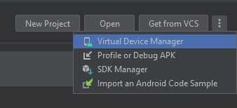
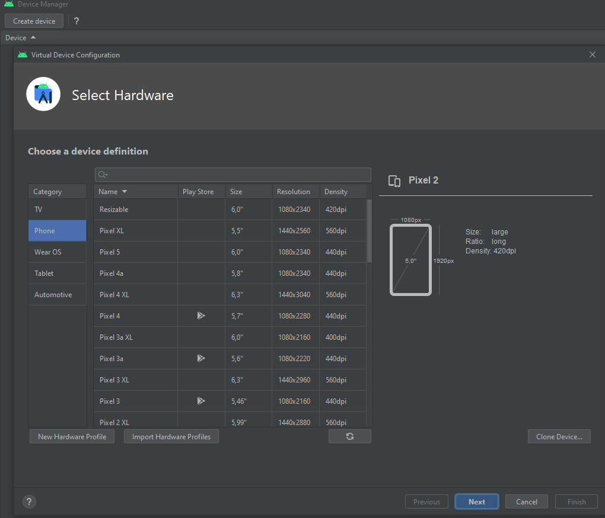
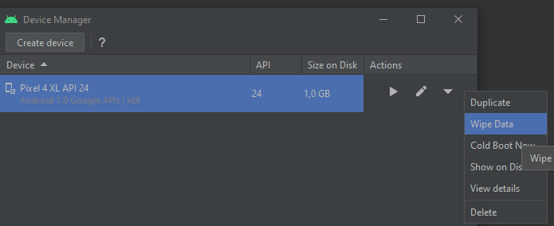
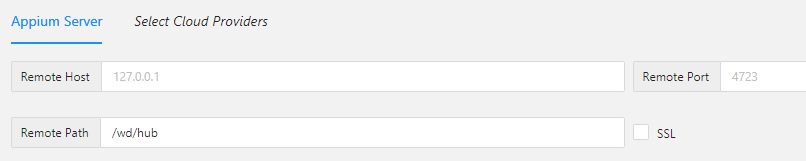
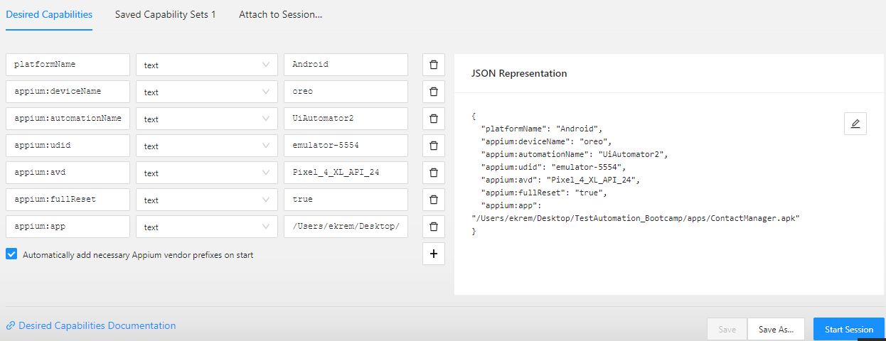

# Lesson #1

Android Studio kurulumu yapıldıktan sonra\
Uygulama içinde **Virtual Device Manager** seçeneğinden sanal test cihazı oluşturulur.

<figure>
    
    <figcaption align = "center"><b>Fig.1.1 - Virtual Device Manager</b></figcaption>
</figure>  

Ardından açılan uygulama üzerinden Device Manager ile birlikte cihaz oluşturulur.
<figure>
    
    <figcaption align = "center"><b>Fig.1.2 - Creating Device with Device Manager</b></figcaption>
</figure>  

Cihaz oluşturulduktan sonra sağ taraftaki açılır menüden "Wipe Data" seçeneği "Yes" olarak onaylanır.
<figure>
    
    <figcaption align = "center"><b>Fig.1.3 - Wipe Data at Created Device</b></figcaption>
</figure>  

Sanal cihaz oluşturulduktan sonra *Appium* Uygulaması açılır.
* Appium uygulamasında **Edit Configuration** seçeneği altından ayar yapılması gerekebilir.
  * Android Home için :  Users veya Kullanıcılar klasörü altında bulunan dosyalardan android/Sdk yolu verilmelidir.
    * Eğer direkt olarak bulunamaz ise *Gizli Dosyalar* görünürlüğü aktif hale getirildikten sonra *appdata/local* dizininde bulunabilir.
  * Java Home için : Hoca MAC işletim sisteminde bu ayarın probleme yol açtığı için ayar yapmadı.
    * Ancak Windows işletim sisteminde bir problem oluşursa o zaman bu yolu verip denenmesi gerekiyor.

Appium dışında bir de Appium Inspector uygulamasına ihtiyaç vardır.
* Eskiden direkt Appium içinde yüklü geliyor olmasına rağmen yeni sürümde dışarıdan yüklenmesi gerekiyor.
  * Bunun için de Appium uygulamasındaki büyüteç simgesinden GitHub üzerindeki ilgili sayfaya yönlendirme yapılarak indirme sağlanabilir.

## Appium Inspector Kullanımı

* Appium Inspector kullanırken **Remote Path** kısmında /wd/hub ifadesi olmadan çalıştırmak mümkün olmadı.
<figure>
    
    <figcaption align = "center"><b>Fig.1.4 - Remote Path Setting</b></figcaption>
</figure> 

* Bunun dışında local host ayarları için referanslardaki ilgili kaynak incelenebilir.  

 
* Android için Capability yazılması gerekiyor.
<figure>
    
    <figcaption align = "center"><b>Fig.1.5 - Capabilities</b></figcaption>
</figure> 

* Hocanın kullandığına benzer şekilde olan Capability ifadesini aşağıda ilettim.

### Capability

{\
"platformName": "Android",\
"appium:deviceName": "oreo",\
"appium:automationName": "UiAutomator2",\
"appium:udid": "emulator-5554",\
"appium:avd": "Pixel_4_XL_API_24",\
"appium:fullReset": "true",\
}

* Hocanın derste kullandığı Contact Manager uygulamasına ilgili referans linkinden erişmek mümkündür.

## References

* [Local Host Setting](https://stackoverflow.com/questions/69374297/i-cantt-connect-appium-server-desktop-and-appium-inspector-with-my-smartphone-w)
* [Contact Manager Apk](https://github.com/appium-boneyard/sample-code/blob/f3ed882ec9e6318c4150e515e162b579fd4752b1/sample-code/apps/ContactManager/ContactManager.apk)
* [Appium Desired Capabilities](http://appium.io/docs/en/writing-running-appium/caps/#uiautomator1)
* [Why We Need Desired Capabilities in Appium](https://blog.knoldus.com/why-we-need-desired-capabilities-in-appium/)
* [Appium Desired Capabilities — Basic Cheat Sheet to Launch Mobile Application (iOS / Android)](https://ivantay2003.medium.com/appium-desired-capabilities-basic-cheat-sheet-to-launch-mobile-application-ios-android-75b664367031)